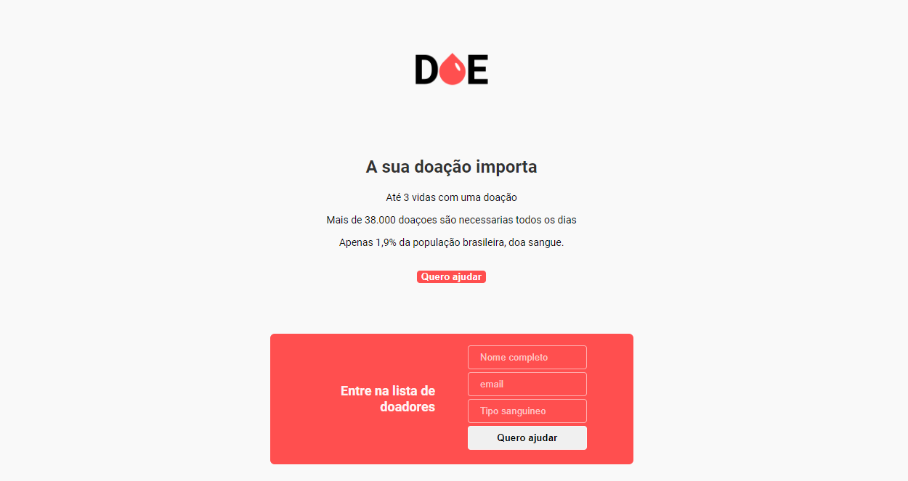
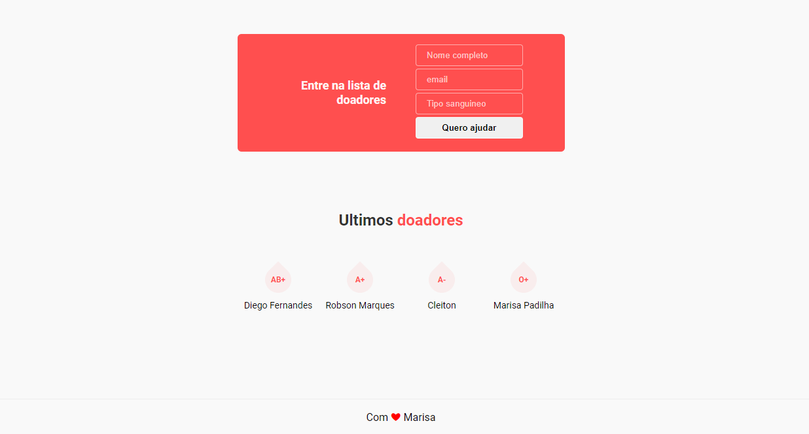

<h1 align="center">Doe sangue</h1>

Projeto desenvolvido na Maratonadev da Rockseat, buscando o aprendizado em programação.

<h3> Tecnoligias utilizadas</h3>

<ul>
    <li>HTML5</li>
    <li>CSS3</li>
    <li>JAVA SCRIPT</li>
    <li>NODE JS</li>
    <li>EXPRESS</li>
    <li>POSTGRES</li>
</ul>

<h4>Para rodar esse projeto, execute o comando abaixo:</h4>

`npm install && npm run start`
